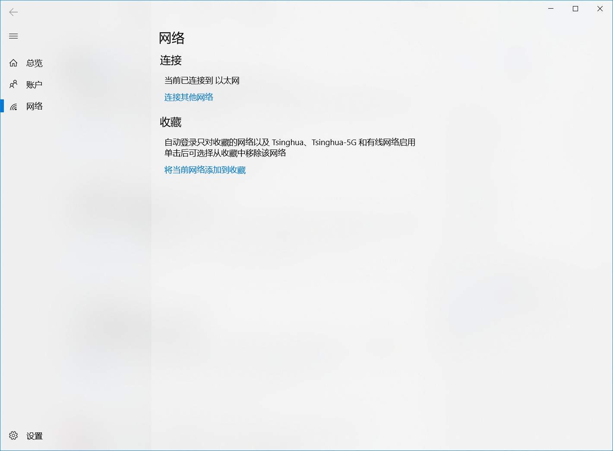

# dotNetCampus

.Net Campus is a Universal Windows Platform app that helps Tsinghua University students better manage their campus network connections and campus accounts.

👉 [Get .Net Campus - Microsoft Store](https://www.microsoft.com/store/productId/9PDVWNT4K1MW)

## Features

### In App

- Wired auth support

- Network usage and balance detail

- Daily usage chart

- Multi-account support

- Session disconnection

### UWP Specials

- Auto-login with toast notifications

- Live tile showing current account status

- Low balance alert with toast notifications

## App Pages

- A general page to show the current usage, network, account and number of sessions at the very first glance. A chart indicating the daily usage trend is also available.

- There is a page for account management where users can have a closer look at those online sessions and choose to disconnect any. This page also enables users to add more than one accounts and switch among them whenever they want.

- This app also provides a single page for users to enable auto-login for their chosen networks. Campus networks in the Favorites would be automatically logged in when connected.

## Screenshots

|  |  |  |
| :------------------------------------------: | :------------------------------------------: | :------------------------------------: |
|                 General Page                 |                 Account Page                 |               WiFi Page                |

## Requirements

### System

- Windows 10, version 1809 build 17763

- Windows 10, version 1803 build 17134

- Windows 10 Fall Creators Update build 16299

### Development

- Visual Studio 2017

- Windows SDK 17763

## Contributing

Issues and pull requests are welcome and greatly appreciated.

## Privacy Policy

See [Privacy Policy](PRIVACYPOLICY.md).

## License

MIT License

Copyright (c) 2019 Robert Ying
